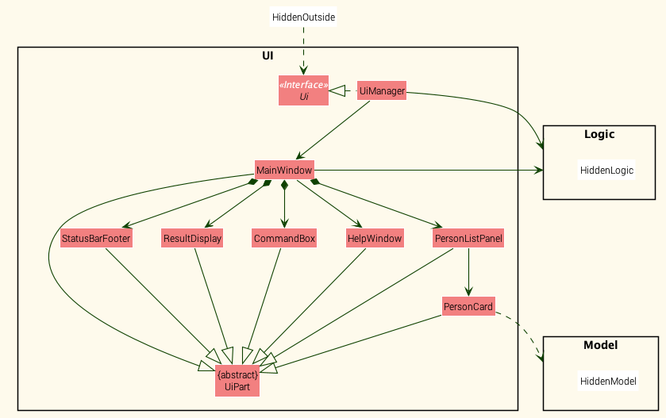
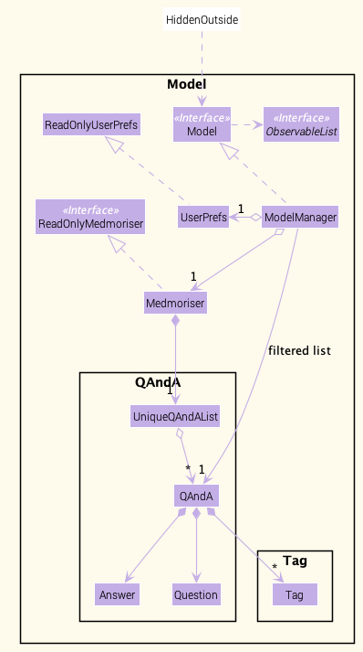
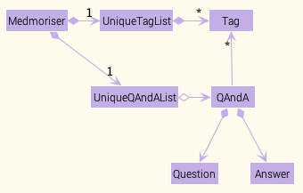
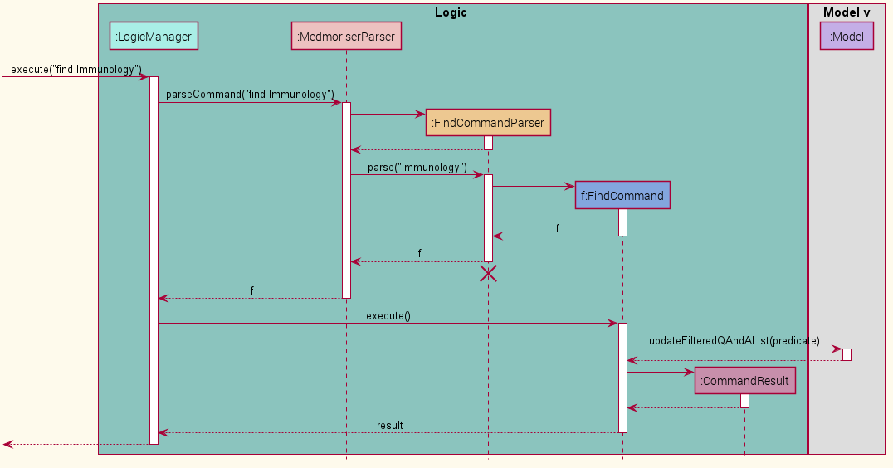
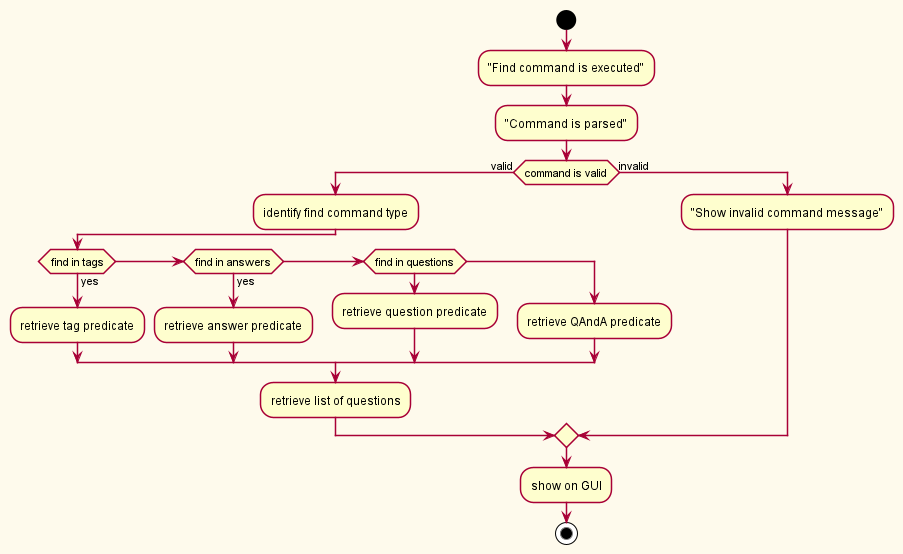
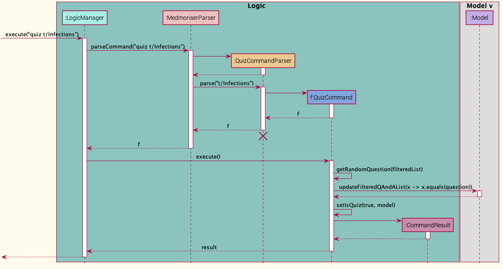
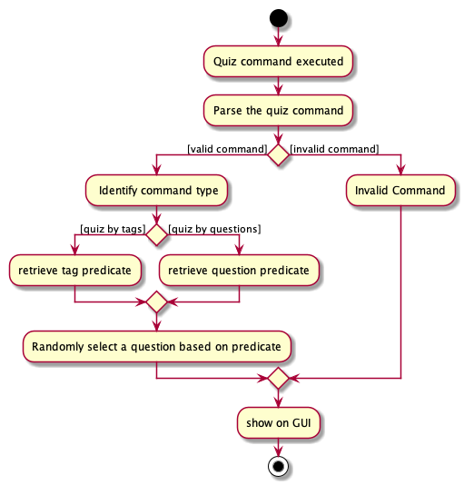
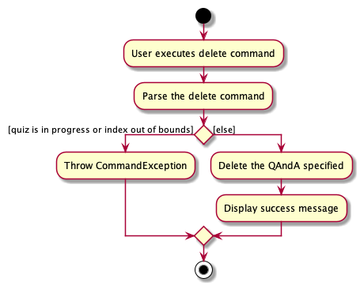
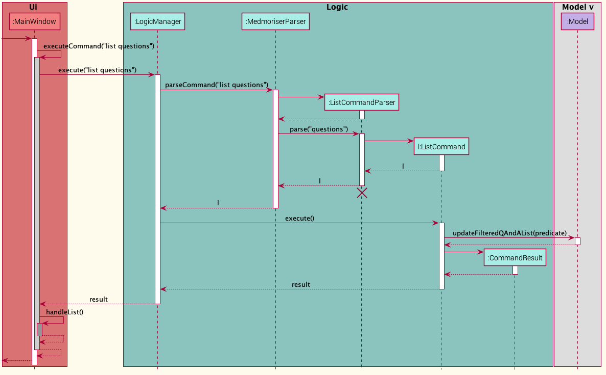
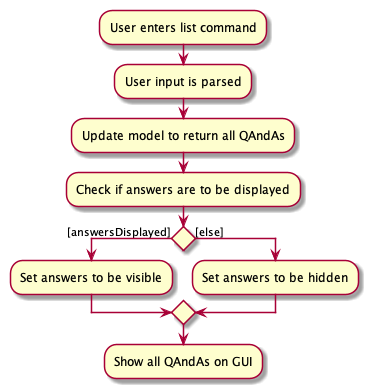

* Table of Contents
{:toc}

--------------------------------------------------------------------------------------------------------------------

## **Setting up, getting started**

Refer to the guide [_Setting up and getting started_](SettingUp.md).

--------------------------------------------------------------------------------------------------------------------

## **Design**

### Architecture

The ***Architecture Diagram*** given above explains the high-level design of the App. Given below is a quick overview of each component.

:bulb: **Tip:** The `.puml` files used to create diagrams in this document can be found in the [diagrams](https://github.com/se-edu/addressbook-level3/tree/master/docs/diagrams/) folder. Refer to the [_PlantUML Tutorial_ at se-edu/guides](https://se-education.org/guides/tutorials/plantUml.html) to learn how to create and edit diagrams.

**`Main`** has two classes called [`Main`](https://github.com/se-edu/addressbook-level3/tree/master/src/main/java/seedu/answer/Main.java) and [`MainApp`](https://github.com/se-edu/addressbook-level3/tree/master/src/main/java/seedu/answer/MainApp.java). It is responsible for,
* At app launch: Initializes the components in the correct sequence, and connects them up with each other.
* At shut down: Shuts down the components and invokes cleanup methods where necessary.

[**`Commons`**](#common-classes) represents a collection of classes used by multiple other components.

The rest of the App consists of four components.

* [**`UI`**](#ui-component): The UI of the App.
* [**`Logic`**](#logic-component): The command executor.
* [**`Model`**](#model-component): Holds the data of the App in memory.
* [**`Storage`**](#storage-component): Reads data from, and writes data to, the hard disk.

Each of the four components,

* defines its *API* in an `interface` with the same name as the Component.
* exposes its functionality using a concrete `{Component Name}Manager` class (which implements the corresponding API `interface` mentioned in the previous point.

For example, the `Logic` component (see the class diagram given below) defines its API in the `Logic.java` interface and exposes its functionality using the `LogicManager.java` class which implements the `Logic` interface.

**How the architecture components interact with each other**

The *Sequence Diagram* below shows how the components interact with each other for the scenario where the user issues the command `delete 1`.

The sections below give more details of each component.

### UI component

**API** :
[`Ui.java`](https://github.com/se-edu/addressbook-level3/tree/master/src/main/java/seedu/answer/ui/Ui.java)

The UI consists of a `MainWindow` that is made up of parts e.g.`CommandBox`, `ResultDisplay`, `PersonListPanel`, `StatusBarFooter` etc. All these, including the `MainWindow`, inherit from the abstract `UiPart` class.

The `UI` component uses JavaFx UI framework. The layout of these UI parts are defined in matching `.fxml` files that are in the `src/main/resources/view` folder. For example, the layout of the [`MainWindow`](https://github.com/se-edu/addressbook-level3/tree/master/src/main/java/seedu/answer/ui/MainWindow.java) is specified in [`MainWindow.fxml`](https://github.com/se-edu/addressbook-level3/tree/master/src/main/resources/view/MainWindow.fxml)

The `UI` component,

* Executes user commands using the `Logic` component.
* Listens for changes to `Model` data so that the UI can be updated with the modified data.

### Logic component

**API** :
[`Logic.java`](https://github.com/se-edu/addressbook-level3/tree/master/src/main/java/seedu/answer/logic/Logic.java)

1. `Logic` uses the `AddressBookParser` class to parse the user command.
1. This results in a `Command` object which is executed by the `LogicManager`.
1. The command execution can affect the `Model` (e.g. adding a qAndA).
1. The result of the command execution is encapsulated as a `CommandResult` object which is passed back to the `Ui`.
1. In addition, the `CommandResult` object can also instruct the `Ui` to perform certain actions, such as displaying help to the user.

Given below is the Sequence Diagram for interactions within the `Logic` component for the `execute("delete 1")` API call.

:information_source: **Note:** The lifeline for `DeleteCommandParser` should end at the destroy marker (X) but due to a limitation of PlantUML, the lifeline reaches the end of diagram.

### Model component

**API** : [`Model.java`](https://github.com/se-edu/addressbook-level3/tree/master/src/main/java/seedu/answer/model/Model.java)

The `Model`,

* stores a `UserPref` object that represents the user’s preferences.
* stores the answer book data.
* exposes an unmodifiable `ObservableList<Person>` that can be 'observed' e.g. the UI can be bound to this list so that the UI automatically updates when the data in the list change.
* does not depend on any of the other three components.

:information_source: **Note:** An alternative (arguably, a more OOP) model is given below. It has a `Tag` list in the `AddressBook`, which `Person` references. This allows `AddressBook` to only require one `Tag` object per unique `Tag`, instead of each `Person` needing their own `Tag` object. 

### Storage component

**API** : [`Storage.java`](https://github.com/se-edu/addressbook-level3/tree/master/src/main/java/seedu/answer/storage/Storage.java)

The `Storage` component,
* can save `UserPref` objects in json format and read it back.
* can save the answer book data in json format and read it back.

### Common classes

Classes used by multiple components are in the `seedu.addressbook.commons` package.

--------------------------------------------------------------------------------------------------------------------

## **Implementation**

This section describes some noteworthy details on how certain features are implemented.

### Find feature (Ming Yang)

#### Implementation

This portion describes the implementation of the find featur which allows the user to find QAndA sets based on the question, answer or tags.

Explanation of the diagrams:
1. As the user parses the find command through the `UI`, the `MedmoriserParser` identifies this as a `FindCommand` and passes the user input to the `FindCommandParser`.
2. The `FindCommandParser` identifies the type of find command, such as find tag/question/answer.
3. A `FindCommand` with the respective predicate such as `TagContainsKeywordPredicate` is created and returned to the `LogicManager`.
4. The filtered list of question will be displayed on the `UI`.

The following sequence diagram, Fig 1.1, shows how the find operation works:

(Figure 1.1: Find Command Sequence Diagram)

The activity diagram below, Fig 1.2, shows the activity flow of the find feature.

(Figure 1.2: Find Command Activity Diagram)

### Quiz Feature (Joshua Tan)

#### Implementation

This feature allows the user to quiz himself/herself.

The flow of the execution is as follows:

1. User enters the input for quiz (eg. `quiz t/Immune System`)

2. The `LogicManager` executes the command, the command is then parsed by `MedmoriserParser` and the command is
identified as a `QuizCommand`. The command is then parsed by `QuizCommandParser`.

3. `QuizCommandParser` identifies the type of quiz command. (eg. quiz t/)

4. A `QuizCommand` with the respective predicate, in this case `TagContainsKeywordPredicate` is created and returned to `LogicManager`

5. The `QuizCard` will be displayed on the `UI`.

The sequence diagram below, Fig 1.3, shows the interactions between the Logic and model components for the quiz command.

(Figure 1.3: Quiz Command Sequence Diagram)

The diagram below, Fig 1.4 shows the activity diagram flow for the quiz command

(Figure 1.4: Quiz Command Activity Diagram)

### Delete Feature (Jian Ling)

#### Implementation

This feature allows the user to delete a QAndA from the answer book. The flow of the execution of the delete command is shown below.

1. User enters the input to delete a QAndA (eg. `delete 1`)

2. The `LogicManager`  executes this command, leading to the command being parsed by `MedmoriserParser` and `DeleteCommandParser`

3. After successful parsing, `DeleteCommand#execute(Model model)` is called. This method checks for the following scenarios:

   - A quiz is currently in progress
   - The index entered by the user is out of bounds

   If any of the scenarios above occur, a `CommandException` will be thrown with their respective error messages. Othewise, a new `CommandResult` is returned, along with a success message that the specified QAndA has been successfully deleted

The sequence diagram (Fig. 1.5) below shows the flow of the delete  feature.

(Figure 1.5: Delete Command Sequence Diagram)

The activity diagram (Fig 1.6) below further shows the flow of the delete feature.

(Figure 1.6: Delete Command Activity Diagram)

### List Feature (Jonathan Foo)

#### Implementation

This section elaborates on the implementation of the list feature.

1. The user enters input to list all QAndAs.

2. The `Ui` component calls the `Logic` component to execute this. `MedmoriserParser` parses the command, resulting in a `ListCommand` object which is executed by  the `LogicManager`.

3. This updates the `Model` to show all QAndAs in the answer book.

4. The result of this command execution is encapsulated as a `CommandResult` object which is passed back to the `Ui`.

5. `Ui` checks the `CommandResult` object and modifies the visibility of the `Answer` label. In this case, the visibilty is set to `hidden`

The sequence diagram below, Fig 1.7 shows the interactions between the Ui and Logic components for the list command.

(Figure 1.7: List Command Sequence Diagram)

The following activity diagram, Fig 1.8 summarises what happens when a user executes the `list` command.

(Figure 1.6: List Command Activity Diagram)

#### Design considerations:
* The `Ui` component was selected to perform the showing/hiding of answers as it already had access to the various components in the GUI, hence preventing further coupling between the different components.
* We decided to use `list` rather than `list all` to show all questions and answers as we wanted to maintain the original functionality of the `list` command.

### \[Proposed\] Data archiving

_{Explain here how the data archiving feature will be implemented}_

--------------------------------------------------------------------------------------------------------------------

## **Documentation, logging, testing, configuration, dev-ops**

* [Documentation guide](Documentation.md)
* [Testing guide](Testing.md)
* [Logging guide](Logging.md)
* [Configuration guide](Configuration.md)
* [DevOps guide](DevOps.md)

--------------------------------------------------------------------------------------------------------------------

## **Appendix: Requirements**

### Product scope

**Target user profile**:

* medical students with heavy content to memorise
* has a need to manage and frequently revisit a significant number of questions and answers
* has a need to refer to images and diagrams
* prefer desktop apps over other types
* finds typing with a keyboard faster than typing with smartphones or handwriting.
* prefers typing to mouse interactions
* is reasonably comfortable using CLI apps

**Value proposition**:
* Aggregate and organises contents and much faster than traditional methods.
* Allows students to memorise contents more efficiently by continuously testing them. This way they can practice active recall.

### User stories

Priorities: High (must have) - `* * *`, Medium (nice to have) - `* *`, Low (unlikely to have) - `*`

| Priority | As a …​                                    | I want to …​                     | So that I can…​                                                           |
| -------- | ------------------------------------------ | ------------------------------ | -------------------------------------------------------------------------|
| `* * *`  | new user                                   | see usage instructions         | refer to instructions when I forget how to use the App                   |
| `* * *`  | user                                       | key in questions and answers   | revise on the questions I keyed in                                       |
| `* * *`  | user                                       | delete a Q&A                   | remove entries that I no longer need                                     |
| `* * *`  | user                                       | edit existing questions and answers   | make changes to the questions and answers                         |
| `* * *`  | user                                       | see all the questions          | have an overview of all the Q&As I have                                  |
| `* *`  | user                                       | find questions by keywords     | locate the Q&A without having to go through the entire list of questions |
| `* * `   | user                                       | tag questions to its topics    | organise the questions properly by topic                                 |
| `*`   | organised user                             | archive questions I no longer need | keep my question book organised and updated                          |

*{More to be added}*

### Use cases

(For all use cases below, the **System** is the `Medmoriser` and the **Actor** is the `user`, unless specified otherwise. Q&A stands for a question and answer pair)

**Use case: UC01 - Add a Q&A**

**MSS**

1. User adds a new Q&A into the database

2. Medmoriser adds the new Q&A and displays a success message

   Use case ends.

**Extensions**

- 1a. The entered data is invalid

  - 1a1. Medmoriser displays an error message

    Use case ends.

**Use case: UC02 - View all Q&As**

**MSS**

1. User requests to view all Q&As

2. Medmoriser shows a list of Q&As in the database

   Use case ends.

**Use case: UC03 - Delete a Q&A**

**MSS**

1. User requests to view all Q&As

2. Medmoriser shows a list of Q&As in the database

3. User requests to delete a Q&A at a specific index on the list

4. Medmoriser deletes the Q&A and displays success message

   Use case ends

**Extensions**

- 2a. The list is empty.

  Use case ends.

- 3a. The given index is invalid.

  - 3a1. Medmoriser shows an error message.

    Use case resumes at step 2.

**Use case: UC04 - Add a tag to a Q&A**

**MSS**

1. User requests to view all Q&As

2. Medmoriser shows a list of Q&As in the database

3. User requests to add a tag to a Q&A at a specific index on the list

4. Medmoriser adds the specified tag to the Q&A and displays success message

   Use case ends.

**Extensions**

- 2a. The list is empty.

  Use case ends.

- 3a. The given index is invalid.

  - 3a1. Medmoriser shows an error message.

    Use case resumes at step 2.

- 3b. The given tag is invalid.

  - 3b1. Medmoriser shows an error message.

    Use case resumes at step 2.

**Use case: UC05 - Edit a Q&A**

**MSS**

1. User requests to view all Q&As

2. Medmoriser shows a list of Q&As in the database

3. User requests to edit a Q&A at a specific index on the list

4. Medmoriser edits the Q&A at the specified index according to the user's new input and displays success message

   Use case ends

**Extensions**

- 2a. The list is empty.

  Use case ends.

- 3a. The given index is invalid.

  - 3a1. Medmoriser shows an error message.

    Use case resumes at step 2.

- 3b. The edit request is invalid

  - 3b1. Medmoriser shows an error message

    Use case resumes at step 2.

**Use case: UC06 - Find a Q&A**

**MSS**

1. User searches for a key word or phrase

2. Medmoriser shows a list of Q&As with that specified word or phrase

   Use case ends

**Extensions**

- 2a. There are no Q&As that contain the specified word or phrase

  - 2a1. Medmoriser displays message that no Q&As found

    Use case ends

*{More to be added}*

### Non-Functional Requirements

1.  Data bank should be able to hold large number (500+) pairs of question and answers without any sluggish performance
    for typical usage.
2.  Users should be able to retrieve answers to a question with a single command
3.  User should be able to add a set of question and answers easily and efficiently through a user-friendly GUI
4.  Have a clean user interface when it comes to reviewing questions and answers

*{More to be added}*

### Glossary

* **Question Set**: A set containing a question and answer(s)
* **Question**: A question, which may have one or more answers
* **Answer**: An answer to a question

--------------------------------------------------------------------------------------------------------------------

## **Appendix: Instructions for manual testing**

Given below are instructions to test the app manually.

:information_source: **Note:** These instructions only provide a starting point for testers to work on;
testers are expected to do more *exploratory* testing.

### Launch and shutdown

1. Initial launch

   1. Download the jar file and copy into an empty folder

   1. Double-click the jar file Expected: Shows the GUI with a set of sample contacts. The window size may not be optimum.

1. Saving window preferences

   1. Resize the window to an optimum size. Move the window to a different location. Close the window.

   1. Re-launch the app by double-clicking the jar file. 
       Expected: The most recent window size and location is retained.

1. _{ more test cases …​ }_

### Deleting a qAndA

1. Deleting a qAndA while all qAndAs are being shown

   1. Prerequisites: List all qAndAs using the `list` command. Multiple qAndAs in the list.

   1. Test case: `delete 1` 
      Expected: First contact is deleted from the list. Details of the deleted contact shown in the status message. Timestamp in the status bar is updated.

   1. Test case: `delete 0` 
      Expected: No qAndA is deleted. Error details shown in the status message. Status bar remains the same.

   1. Other incorrect delete commands to try: `delete`, `delete x`, `...` (where x is larger than the list size) 
      Expected: Similar to previous.

1. _{ more test cases …​ }_

### Saving data

1. Dealing with missing/corrupted data files

   1. _{explain how to simulate a missing/corrupted file, and the expected behavior}_

1. _{ more test cases …​ }_
