## Introduction

Hi Medical Student! Welcome to the User Guide for **Medmoriser**!

**Medmoriser** is a desktop app to help medical students organise, memorise and revise their content.

This guide aims to orientate you to the features of **Medmoriser**. If you're looking for a quiz
management system, this guide will give you all the information you need to get started with **Medmoriser**.

* Table of Contents:
{:toc}

--------------------------------------------------------------------------------------------------------------------

## How to use this guide

The explanation for each feature follows the template:

> Introduction of feature
>
> Format of command
>
> * Details about behaviour of the command
> * are in the bulletpoints
>
> Examples:
>
> * example of the command usage

**:information_source: Notes about the command format:** 

* Words in `UPPER_CASE` are the parameters to be supplied by the user. 
  e.g. in `add q/QUESTION`, `QUESTION` is a parameter which can be used as `add q/What is the heart responsible for?`.

* Items in square brackets are optional. 
  e.g. `q/QUESTION [t/TAG]` can be used as `q/What is the heart responsible for? t/cardiology` or as `q/What is the heart responsible for?`

* Items with `…`​ after them can be used multiple times including zero times. 
  e.g. `[t/TAG]…​` can be used as ` ` (i.e. 0 times), `t/heart`, `t/heart t/cardiology` etc.

* Parameters can be in any order. 
  e.g. if the command specifies `q/QUESTION a/ANSWER`, `a/ANSWER q/QUESTION` is also acceptable.

## Features

This section will bring you through various features of Medmoriser. After this section, you will know how to use most of the commands available.

You can follow the instructions one by one, or jump to your feature of interest. For a summary of all commands, please refer to the [Command Summary](#command-summary) section at the end of this guide.

### Viewing help: `help`

If you need to view the help page, this command shows a message explaining how to access it.

Format: `help`

### Adding a QAndA: `add` (by: Cheng Jiyuqing)

You can add a QAndA to the database. You can tag this pair with tag(s) of your choice. It is also okay to not tag the question at all.

Format: `add q/QUESTION a/ANSWER [t/TAG]…​`

Examples:
* `add q/what organ system is the lungs part of? a/respiratory system.`
* `add q/what organ system is the lungs part of? a/respiratory system? t/Body systems t/Respiratory system.`
* `add q/what is the function of the heart? a/It's the muscle at the centre of your circulation system, pumping blood around your body as your heart beats. This blood sends oxygen and nutrients to all parts of your body, and carries away unwanted carbon dioxide and waste products.`

How it should look in the application:

Add with tag:

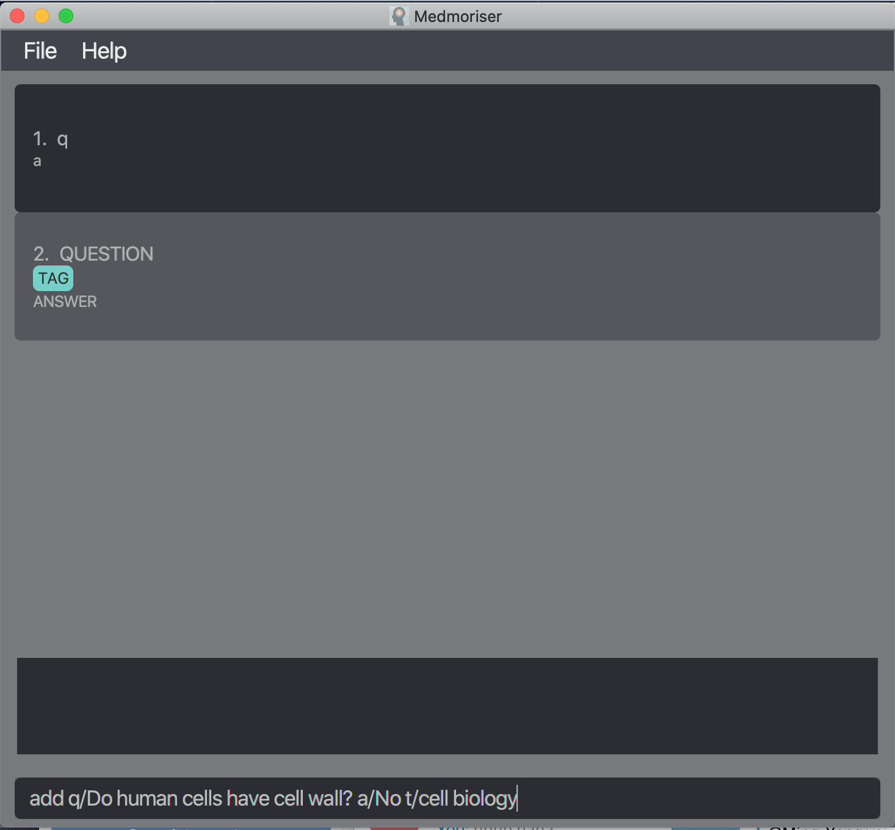

Expected result:

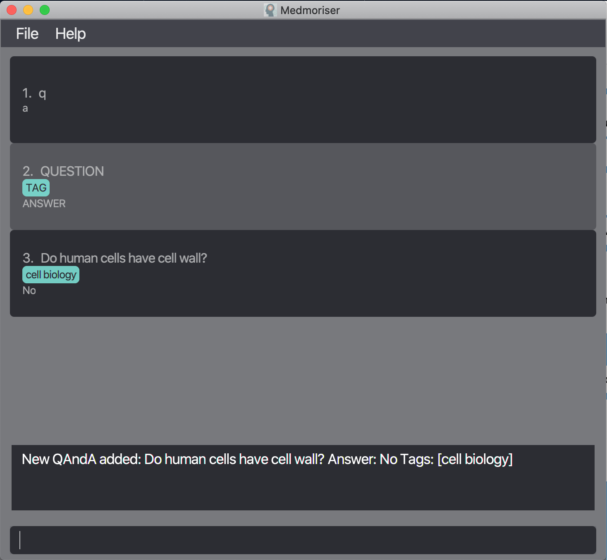

### Deleting a QAndA: `delete` (by: Teng Jian Ling)

You can delete a specified QAndA from the database.

Format: `delete INDEX`

* This allows you to delete the QAndA at the specified `INDEX`.
* The index refers to the index number shown in the displayed QAndA list.

Examples:

* `list` followed by `delete 2` deletes the 2nd QAndA in the list.
* `find disease` followed by `delete 1` deletes the 1st QAndA in the results of the `find` command.

**:information_source: Note about the delete command:** 

The index **must be a positive integer** (1, 2, 3, ...) within the range of the number of QAndAs in the displayed list.

How it should look in the application:

Entering the command:

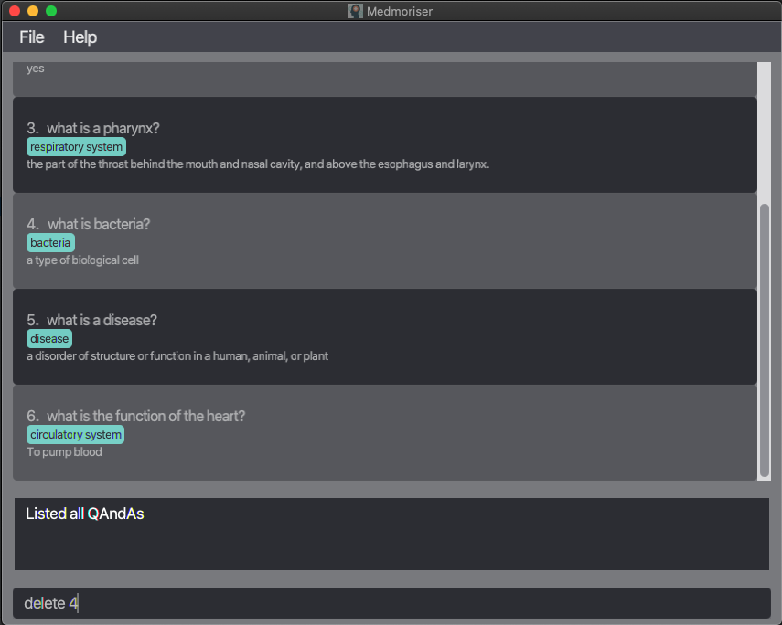

Expected Result:

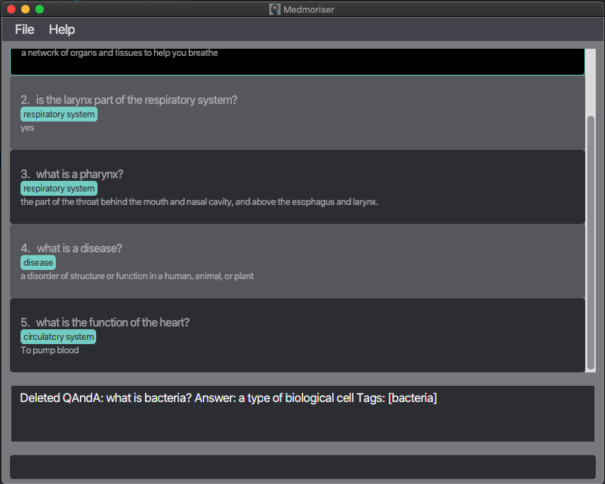

The `delete 4 ` command deletes the 4th QAndA in the database, as shown above.

### Listing all QAndAs: `list` (by: Jonathan Foo)

You can use this command to view all the QAndAs you have added.

Format: `list [questions]`

* Entering `list` will list all QAndAs, with both questions and answers displayed.
* Adding the `questions` parameter will list all QAndAs, with only the questions displayed (i.e. hide the answers)

Examples:
* `list` - show all questions and answers
* `list questions` - show all questions

The expected behaviour of `list` is shown below:

The expected behaviour of `list questions` is shown below:

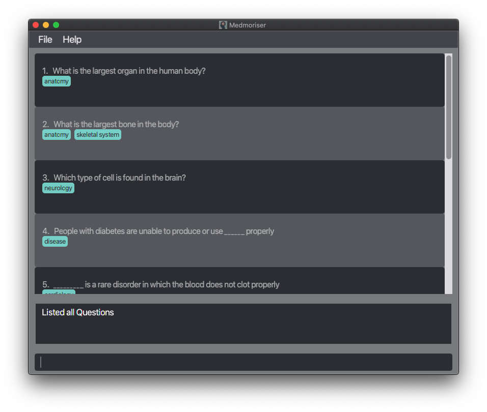

### Editing a QAndA: `edit` (by: Teng Jian Ling)

You can make changes to an existing QAndA with this command.

Format: `edit INDEX [q/QUESTION] [a/ANSWER] [t/TAG]…​`

* This allows you to edit the QAndA at the specified `INDEX`. The index refers to the index number shown in the displayed QAndA list.
* Existing values will be updated to the input values.

Examples:

*  `edit 1 a/To pump blood` - Edits the answer the 1st question to be `To pump blood`.
*  `edit 2 q/how many bones are there in an ADULT human skeleton? t/` - Edits the question of the 2nd QAndA to be `how many bones are there in an ADULT human skeleton?` and clears all existing tags.

**:information_source: Notes about the edit command:** 

* When you edit the tags, the existing tags of the QAndA will be removed i.e adding of tags is not cumulative.
* You must provide at least one of the optional fields.
* The index **must be a positive integer** (1, 2, 3, ...) within the range of the number of QAndAs in the displayed list.

**:bulb: Tip:** 

You can remove all the QAndA's tags by typing `t/` without specifying any tags after it.

How it should look in the application:

Entering the edit command:

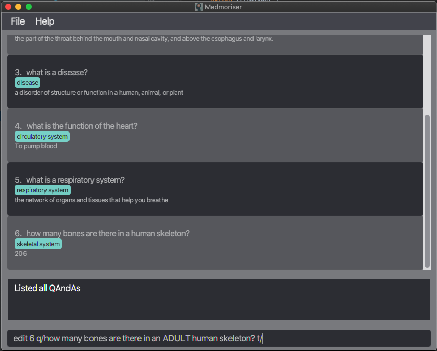

Expected Result:

The `edit 6 q/how many bones are there in an ADULT human skeleton? t/ ` input will edit the QAndA at index 6 and remove all tags as shown.

### Finding QAndA by keywords: `find` (by: Yong Ming Yang)
The `find` function allows you to find existing QAndA based on keywords and phrases.

If you would like to search the database based on keywords or phrases, you can do so in a few ways by following the respective formats:

1. Find QAndA with **questions** containing any of the given keywords.

    Format: `find q/KEYWORD`, for 2 or more words: `find q/PHRASE 1, KEYWORD1`

2. Find QAndA with **answers** containing any of the given keywords.

    Format: `find a/KEYWORD`, for 2 or more words: `find q/PHRASE 1, KEYWORD1`

3. Find QAndA with **tags** containing any of the given keywords.
    Keywords for tags can also have phrases, however this requires the text to have an exact match (case-insensitive).

    Format: `find t/KEYWORD`, for 2 or more words: `find q/PHRASE1, KEYWORD1`

4. Find QAndA with **questions or answers** containing any of the given keywords.

    Format: `find KEYWORD`, for 2 or more words: `find PHRASE, KEYWORD1`

Examples:
* `find q/system, disease` - finds questions containing the word "system" and/or "disease".
* `find a/vessels, chronic disease` - finds answers containing the word vessels, and/or the phrase "chronic disease".
* `find t/anatomy, Nervous System` - finds QAndAs tagged with the word "anatomy" and/or "Nervous System" (can be both), requires exact match of words (case-insensitive).
* `find infection, nervous system` - finds question and/or answers containing the word "infection", and/or the phrase "nervous system"

**:bulb: Tip:** 
`PHRASE` refers to words with spaces in between, for example: "nervous system"

How it should look like in the application:

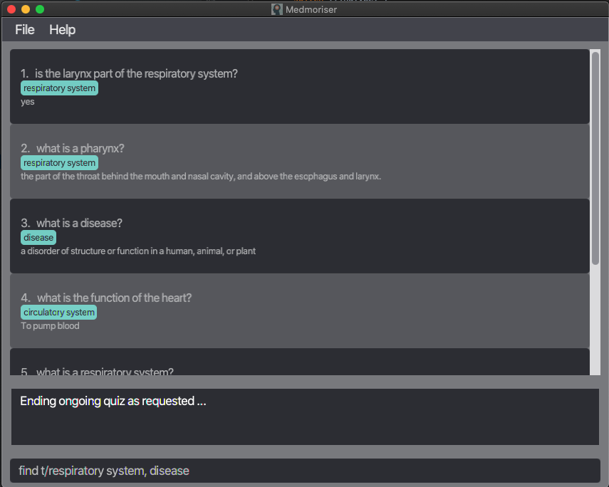

Expected Result:

The input `find t/respiratory system, disease` will return the questions with the tag "respiratory system" and/or "disease"
as shown.

### Clearing all entries: `clear`

If you want to reset your question book, this command clears all existing entries.

Format: `clear`

### Starting a quiz: `quiz` (by: Joshua Tan)

You will be able to test yourself on your knowledge from the questions that you added into the application.
Medmoriser will randomly select a question to quiz you based on the keywords you provide.

There are 2 ways that you can quiz yourself. By question keywords or by tag keywords. If multiple keywords are given, you will be quizzed on a question that has any of the keywords, or all of the keywords.

1. Quiz a QAndA with **questions** containing any of the given keywords.

    Format: `quiz q/KEYWORD`, for 2 or more words: `quiz q/PHRASE 1, KEYWORD 1`

2. Quiz a QAndA wih **tag** containing any of the given keywords.

    Format: `quiz t/KEYWORD`, for 2 or more words: `quiz t/PHRASE 1, KEYWORD 1`

Examples:
* `quiz q/immunology` - randomly quizzes a question containing the word "immunology".
* `quiz t/surgery, injuries` - randomly quizzes a question that was tagged with the word "surgery" and/or "injuries" (can be both), requires exact match of words (case-insensitive).

**:bulb: Tip:** 
To run other commands other than `next` or `answer`, you have to first `endquiz`.

How it should look like in the application:

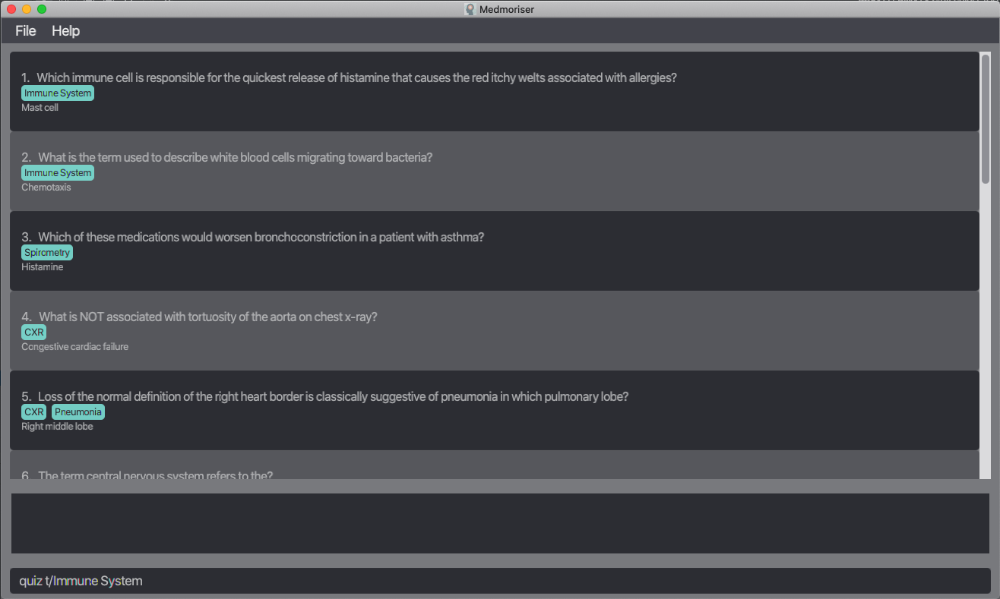

Expected Result:

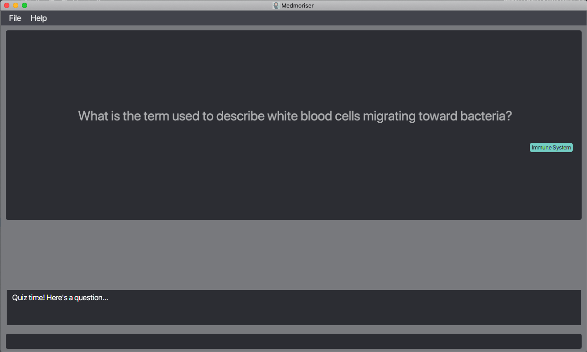

### Answering a quiz question: `answer` (by: Joshua Tan)
You will be able to key in your answer for a quiz question. After your answer is submitted, Medmoriser will flash the correct answer to the question and you will be able to check your answer:

Format: `answer YOUR_ANSWER`

Example:
* `answer This is my answer to the quiz question`

### Moving to next quiz question: `next` (by: Teng Jian Ling)
You will be able to continue testing yourself without ending the current quiz. Medmoriser will randomly select a different quiz question based on the same keywords you provided previously.

Format: `next`

Example:
* `next` - will show you the next question in this quiz

**:bulb: Tip:** 
If you want to skip the current quiz question, you can enter `next` without answering first.

**:information_source: Notes about the edit command:** 

* You can only use the `next` command when you are in an ongoing quiz.
* When there are no more questions with the specified keywords, you will not be able to use `next` to retrieve another quiz question.

How it should look like in the application:

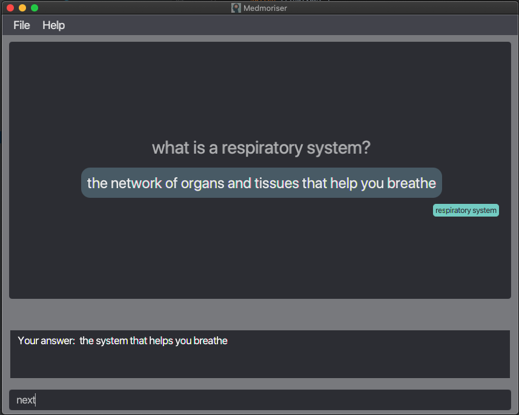

Expected Result:

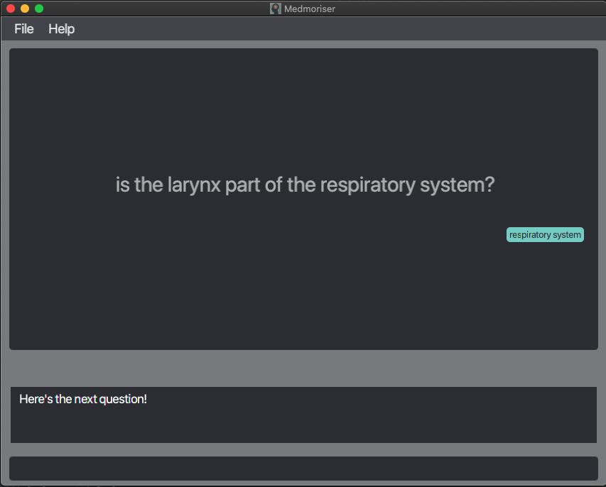

Assuming the user is in a quiz for `t/respiratory system`, the input `next` will display a new randomly selected question with the tag `respiratory system`, as shown above. 

### Ending a quiz: `endquiz` (by: Joshua Tan)
Once you are done with a quiz and have finished comparing your input answer with the answer in the question, you have to end the quiz to run other commands.
If you want to run other commands in the midst of a quiz(ie. if you have not answered the question) you have to end the quiz first:

Format: `endquiz`

### Exiting the program: `exit`

If you're done with your work, this command allows you to exit the program. You can also exit the application by closing its window like any normal program window.

Format: `exit`

### Saving the data

You don't need to worry about saving data manually, as Medmoriser data is automatically saved in the hard disk after any command that changes the data.

### Archiving data files [Coming Soon]

If you don't need certain questions anymore, you can archive them to declutter your workspace.

--------------------------------------------------------------------------------------------------------------------

## FAQ
Commonly asked questions and answers.

**Q**: How do I transfer my data to another Computer? 
**A**: Install the app in the other computer and overwrite the empty data file it creates with the file that contains the data of your previous Medmoriser home folder.

--------------------------------------------------------------------------------------------------------------------

## Command summary
A brief summary of all the commands available. For details of when and how each command should be used, please refer to 
the [Features](#features) section.

Action | Format, Examples
--------|------------------
**Add** | `add q/QUESTION a/ANSWER [t/TAG]…​`   e.g. `add q/What does the heart do? a/Pump blood t/heart t/cardiology`
**Delete** | `delete INDEX`  e.g. `delete 3`
**List** | `list [questions]`
**Edit** | `edit INDEX [q/QUESTION] [a/ANSWER] [t/TAG]…​`   e.g. `edit 1 a/Maintain blood pressure t/cardiology`
**Find** | `find KEYWORD or [q/QUESTION_KEYWORD] or [a/ANSWER_KEYWORD] or [t/TAG_KEYWORD]`   e.g. `find system` or `find a/answer1, answer 2`
**Quiz** | `quiz [q/QUESTION_KEYWORD] or [t/TAG_KEYWORD]`   e.g. `quiz q/blood` or `quiz t/Immune System`
**Answer** | `answer YOUR_ANSWER`   e.g. `answer This is my answer`
**Next** | `next`
**End Quiz** | `endquiz`
**Clear** | `clear`
**Help** | `help`
**Exit** | `exit`

