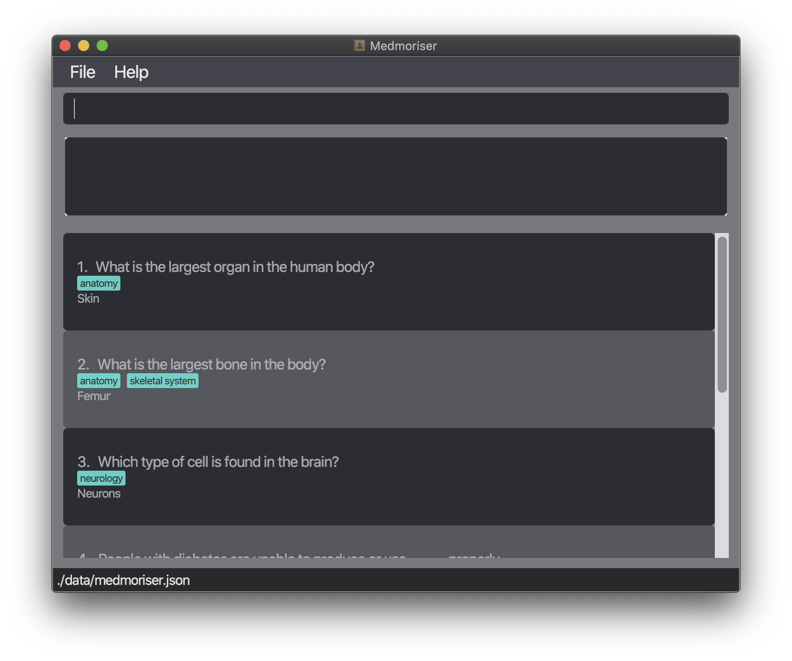

Medmoriser is a **desktop** app to help medical students memorise and revise their content. It is optimized for
 CLI users so that frequent revisions can be done faster by typing in commands.

* Table of Contents
{:toc}

--------------------------------------------------------------------------------------------------------------------

## Quick start

1. Ensure you have Java `11` or above installed in your Computer.

1. Download the latest `addressbook.jar` from [here](https://github.com/se-edu/addressbook-level3/releases).

1. Copy the file to the folder you want to use as the _home folder_ for your AddressBook.

1. Double-click the file to start the app. The GUI similar to the below should appear in a few seconds. Note how the app contains some sample data. 
   

1. Type the command in the command box and press Enter to execute it. e.g. typing **`help`** and pressing Enter will open the help window. 
   Some example commands you can try:

   * **`list`** : Lists all contacts.

   * **`add`**`n/John Doe p/98765432 e/johnd@example.com a/John street, block 123, #01-01` : Adds a contact named `John Doe` to the Address Book.

   * **`delete`**`3` : Deletes the 3rd contact shown in the current list.

1. Refer to the [Features](#features) below for details of each command.

--------------------------------------------------------------------------------------------------------------------

## Features

**:information_source: Notes about the command format:** 

* Words in `UPPER_CASE` are the parameters to be supplied by the user. 
  e.g. in `add n/NAME`, `NAME` is a parameter which can be used as `add n/John Doe`.

* Items in square brackets are optional. 
  e.g `n/NAME [t/TAG]` can be used as `n/John Doe t/friend` or as `n/John Doe`.

* Items with `…`​ after them can be used multiple times including zero times. 
  e.g. `[t/TAG]…​` can be used as ` ` (i.e. 0 times), `t/friend`, `t/friend t/family` etc.

* Parameters can be in any order. 
  e.g. if the command specifies `n/NAME p/PHONE_NUMBER`, `p/PHONE_NUMBER n/NAME` is also acceptable.

### Viewing help : `help`

Shows a message explaning how to access the help page.

Format: `help`

### Adding a set of Question & Answer: `add`

Adds a question and answer pair to the database.

Format: `add q/some question a/some answer`

:bulb: **Tip:**
A person can have any number of tags (including 0)

Examples:
* `add q/what organ system is the lungs part of? a/respiratory system`
* `add q/what is the function of the heart? a/It's the muscle at the centre of your circulation system, pumping blood
 around your body as your heart beats. This blood sends oxygen and nutrients to all parts of your body, and carries away unwanted carbon dioxide and waste products.`

### Listing all Questions & Answers : `list`

Shows the entire database of question and answer pairs in the database.

Format: `list`

### Deleting a set of Question & Answer : `delete`

Deletes a question and answer pair from the database.

Format: `delete Q&A#`

* Deletes the Question & Answer set number '#'

Examples:
* `list` followed by `delete 3` deletes the 3rd question & answer set in the data bank.

## Command summary

Action | Format, Examples
--------|------------------
**Add** | `add n/NAME p/PHONE_NUMBER e/EMAIL a/ADDRESS [t/TAG]…​`   e.g., `add n/James Ho p/22224444 e/jamesho@example.com a/123, Clementi Rd, 1234665 t/friend t/colleague`
**Delete** | `delete INDEX`  e.g., `delete 3`
**List** | `list`

